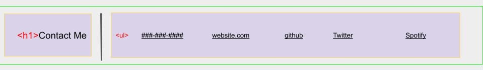
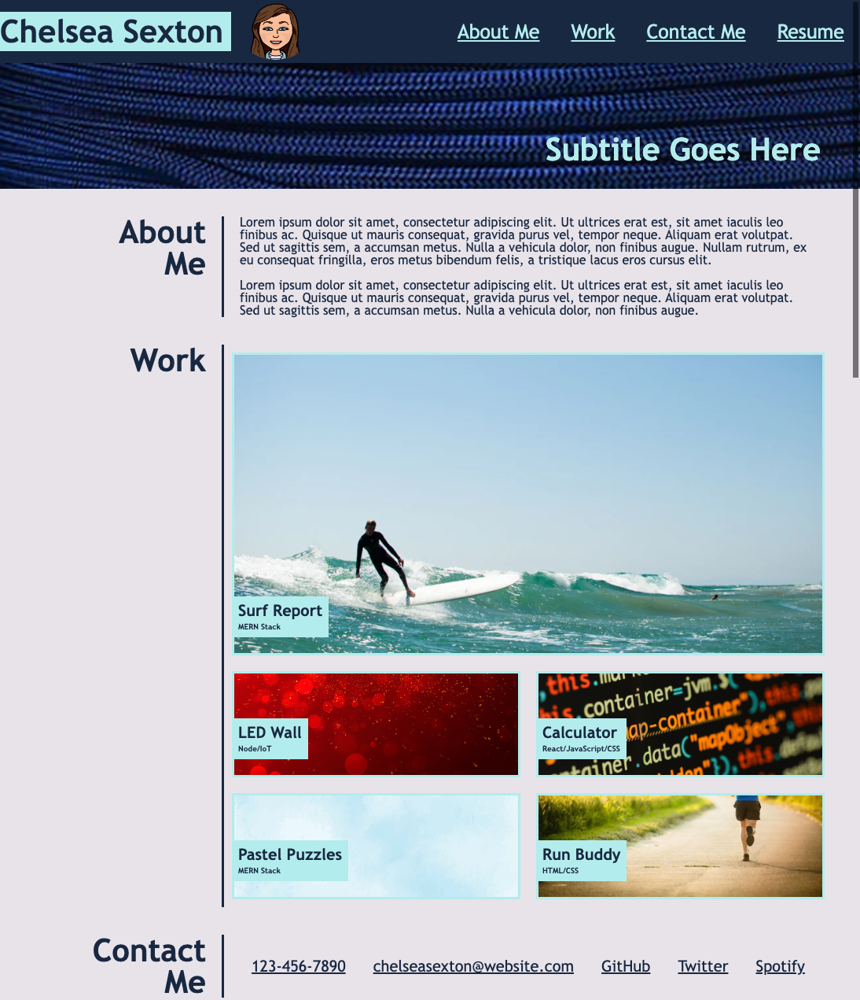

# Module-2-Challenge---Professional-Portfolio

# Overview
The purpose of this project is to create a professional portfolio that showcases work samples, contact information, and is responsive to different screen sizes.

As a class, our goal was to try to recreate the image below 'pixel for pixel' while incorporating our own information for future use in our job search. This portfolio will be updated throughout our course as we continue creating content.  

 

.png)

 

# Wireframe
I approached this project by first creating a wireframe to organize the content accordingly. 

 

# Deployed Website
Follow Link to view my Module 2 - Challenge - Professional Portfolio:

[Chelsea Sexton Professional Portfolio](https://chelsea314.github.io/Module-2-Challenge---Professional-Portfolio/)

 

# View Site Screenshot

 

# Collaborators
[Chelsea Sexton](https://github.com/chelsea314)
 

Special thanks to...
 
* [Sara Baqla](https://github.com/missatrox44)
 
* [Alex Sexton](https://github.com/SlexAxton)

 

# Resources
* CSS-Tricks-Flex-Box: 
    * https://css-tricks.com/snippets/css/a-guide-to-flexbox/
* Flexbox Images Responsive Grid Gallery Tutorial: 
    * https://youtu.be/leoG0qRaFDI
* MDN:
    * https://developer.mozilla.org/en-US/

 

# License
MIT License

Copyright (c) 2022 Chelsea Sexton

Permission is hereby granted, free of charge, to any person obtaining a copy
of this software and associated documentation files (the "Software"), to deal
in the Software without restriction, including without limitation the rights
to use, copy, modify, merge, publish, distribute, sublicense, and/or sell
copies of the Software, and to permit persons to whom the Software is
furnished to do so, subject to the following conditions:

The above copyright notice and this permission notice shall be included in all
copies or substantial portions of the Software.

THE SOFTWARE IS PROVIDED "AS IS", WITHOUT WARRANTY OF ANY KIND, EXPRESS OR
IMPLIED, INCLUDING BUT NOT LIMITED TO THE WARRANTIES OF MERCHANTABILITY,
FITNESS FOR A PARTICULAR PURPOSE AND NONINFRINGEMENT. IN NO EVENT SHALL THE
AUTHORS OR COPYRIGHT HOLDERS BE LIABLE FOR ANY CLAIM, DAMAGES OR OTHER
LIABILITY, WHETHER IN AN ACTION OF CONTRACT, TORT OR OTHERWISE, ARISING FROM,
OUT OF OR IN CONNECTION WITH THE SOFTWARE OR THE USE OR OTHER DEALINGS IN THE
SOFTWARE.